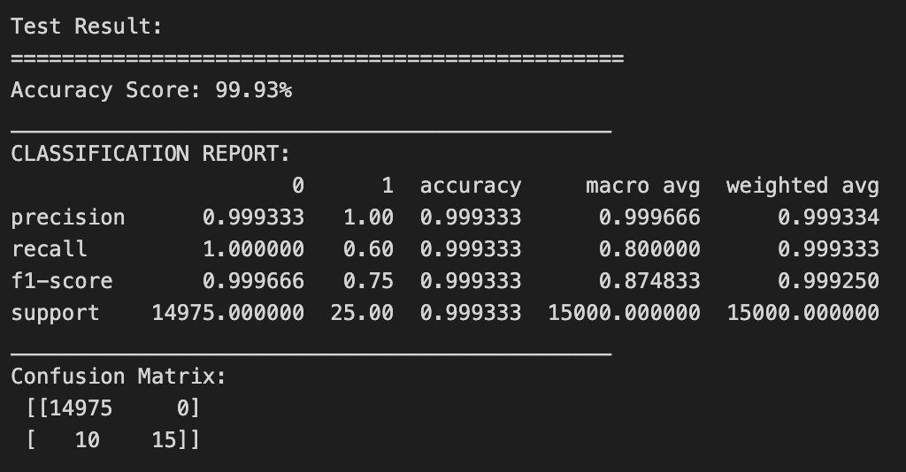

# financial-fraud-detection-lab

## Project Overview

In this project, we are analyzing a large dataset for financial banking transactions. Our goal is to identify and flag as many fradulent cases as possible, while minimizing false positives as much as we can. The challenge of this project is the class imbalance of our dataset, where there would be an overwhelmingly more non-fraudulent transactions than there are fradulent. 

For this project we will be utilizing supervised learning method using Ensemble Methods.

The original dataset contained over a million rows. It was too computationally heavy to complete this project without access to cloud based resources. For this project I've decided to use a sample of only 50,000 from the original dataset.

## 01 Exploratory Data Analysis

During the early stages of the EDA process I noticed that our data is right skewed. Many of the datapoints were difficult to see. I was originally thinking about removing all of the outliers. However, when I started conducting bivariate analysis I noticed that the outliers were actually important. This is because most of the outliers were flagged as being a fradulent transaction. When I thought about it, it makes a lot of sense. Most scammers wouldn't want to scam you out of 10 or 20 dollars, they often go for thousands of dollars at once. It is more likely for higher transaction numbers to be fradulent vs non fradulent. I've also discovered there are few columns which are not needed in the dataset. 

Another interesting point about our dataset is that we were given two columns. One is isFraud, and the other isFlaggedFraud. When conducting a bivariate analysis on both columns using a heatmap, I noticed that there were high colerations between both columns detecting non fradulent cases, but isFlaggedFraud failed to detect many of the actual isFraud cases.

## 02 Data Wrangling

In the second step I cleaned and exported the data, dropping unneccessary columns and data in order to prepare us for the third step which is building predictive models. I decided specifically to drop the names in our dataset which includes columns such as "nameOrig" and "nameDest". I've also decided to transform my type column into a numerical label. 

## 03 Modeling

Finally, I've decided to train a few models with our sample dataset using Decision Tree, RandomForestClassifier and finding the best possible hyperparameters using GridSearchCV, RandomSearchCV. 

1. Decision Tree Classifier

We achieved a high accuracy score of 99.94%. Normally, this would be a very good sign that our model did a great job in with its prediction. However in our case, as shown in the EDA process, we have a high class imbalance between isFraud and isn't Fraud. We must analyze other metrics in order to get the bigger picture.

Our model did really well in predicting non-fradulent cases, so we won't go over them in our README, we specifically are more interested on whether or not our model was able to predict rare cases in our model.

Precision Score: 0.90 - Of the cases that we predicted were fraud, actually was fraud. 

Recall: 0.72 - Of all fraud cases in total, how many did the model correctly predict? 

f1-score: 0.80, balanced mean between precision and recall. 

Support: 14975 / 25, only 25 cases were fradulent. 

In conclusion, our model had a hard time predicting fraduent cases correctly (Recall). The precision score could be better, we are letting around 10% of fradulent data slip from our model.

Grid Search CV

Next, we used Grid Search in order to find the best possible hyperparameter for our Decision Tree Classifier.

In the image above, we can see that there has been a slight decrease in our overall accuracy score from 99.94% to 99.93%

Precision Score: 0.90 -> 1 Our precision score went up by 10%.

Recall: 0.72 -> 0.60 Our recall decreased by 12%

f1-score: 0.80 -> 0.75 Our f1-score decreased by 5%

Support: 14975 / 25 Our support remained the same

The Grid Search helped to improve our precision, but performed worst on Recall and f1-score. This is not a good sign for our model. It means that our model had a harder time accurately predicting fradulent cases given all fradulent cases. It wasn't able to detect all fradulent cases easily.

Generally before we train our model, our model is prone to underfitting each time. After training our model, we observed overfitting because our model is performing worse than what we had with the RandomForest. 

2. Random Forest Classifier

Moving on to the Random Forest Classifier. We achieved a high accuracy score of 99.95%. 

Precicion Score: 1 - Of the cases that we predicted were fraud, actually was fraud. 

Recall: 0.72 - Of all fraud cases in total, how many did the model correctly predict? 

f1-score: 0.837, balanced mean between precision and recall. 

Support: 14975 / 25, only 25 cases were fradulent. 

In conclusion, our model did alright at predicting fraduent cases correctly (Recall). However, for the cases that were actually predicted to be fraud was actually 100% fraud. The precision of the model was spot on. 

Random Search CV

Finally, we used Random Search in order to find the best possible hyperparameter for our Random Forest Classifier.

In the image above, we can see that there has been a no improvement in our overall accuracy score.

Precision Score: 1 -> 1 Our precision score remained the same.

Recall: 0.72 -> 0.68 Our recall decreased by 4%

f1-score: 0.837 -> 0.809 Our f1-score decreased by around 3%

Support: 14975 / 25, only 25 cases were fradulent. This remained the same.

The Random Search did not really help our Random Forest Classifier model to perform better.

## Challenges / Improvements for the future

This project overall was quite challenging, I've had to go back and make many different iterations. I caught many of the errors I've made and learned a lot too.

The most challenging part of the project was cleaning the dataset correct and training our model accurately in order to achieve the best result.

In the future I believe this project could be improved upon even more through the use of the following methods.

1) Standardized my data / Scaling my data
2) Possibly oversampling our fradulent transactions using Smote. (We should be very hesistant on undersampling our data as that would lead to data loss)
https://imbalanced-learn.org/stable/references/generated/imblearn.over_sampling.SMOTE.html 

In my EDA I could further explore the relationships from the type column to columns such as isFraud and isFlaggedFraud. For example CASH_OUT, CASH_IN, determining which transaction type is the most important or influential in determining whether something is Fraud or isn't Fraud.

